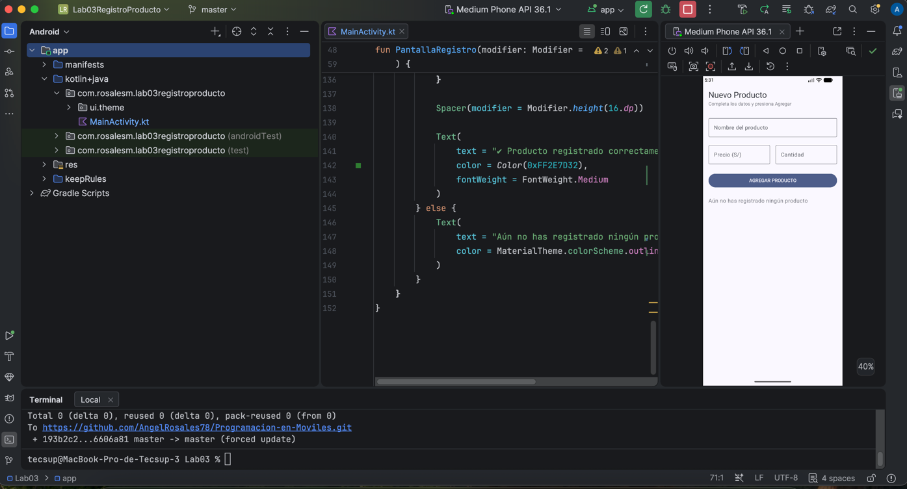
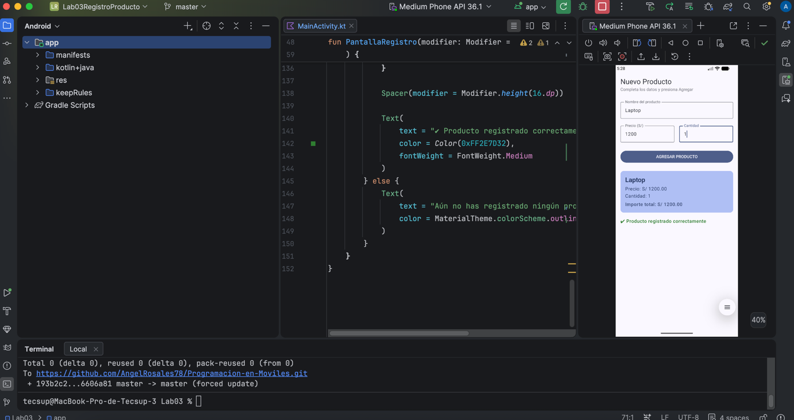

Lab-03
Pantalla inicial:

Producto registrado:

¿Qué pasaría si declaras las variables de los campos SIN `remember`?
Si las variables de estado se declararan sin `remember` el estado no se conservaría durante las recomposiciones de Jetpack Compose.
Cada vez que el usuario escribe un carácter o interactúa con la interfaz, la pantalla se vuelve a renderizar ejecutando nuevamente la función composable.