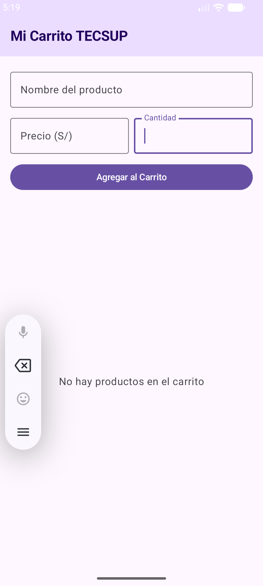
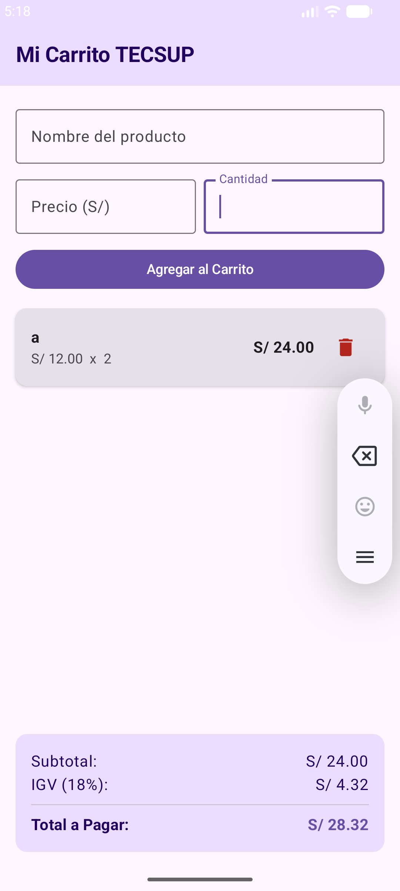

Laboratorio 04: Mi Carrito TECSUP

Estudiante: Rosales Montero Angel C24B

Descripción:
Aplicación móvil desarrollada en Android mediante Jetpack Compose (Material3) para la gestión dinámica de un carrito de compras. Permite registrar productos mediante un formulario, visualizarlos en una lista interactiva con cálculo de subtotales, eliminarlos de forma individual, desplegar el desglose de montos (Subtotal, IGV 18% y Total a Pagar) y mostrar un estado de carrito vacío cuando no hay elementos agregados.

Capturas de Pantalla

| Carrito Vacío | Carrito con Productos |
| :---: | :---: |
|  |  |

Preguntas de Evaluación

(a) ¿Por qué mutableStateListOf y no una MutableList normal?
Porque mutableStateListOf es una colección observable por el runtime de Jetpack Compose. Cuando se agrega, elimina o modifica un elemento dentro de ella, la interfaz de usuario recibe la notificación de forma automática y recompone únicamente las partes afectadas de la pantalla. Una MutableList estándar (mutableListOf) no notifica a Compose sobre sus cambios internos, por lo que la interfaz no se actualizaría de forma reactiva al modificar los productos.

(b) ¿Por qué la lista es val?
Porque la referencia de la colección en memoria permanece inmutable durante todo el ciclo de vida del componente. Lo que cambia es el contenido interno de la lista (sus elementos), no la instancia del objeto SnapshotStateList asignado. Definirla como val garantiza que la referencia no sea sobrescrita por error, manteniendo una gestión de estado segura y consistente.

(c) ¿Qué hace weight(1f) en la LazyColumn?
Le indica a la LazyColumn que debe expandirse dinámicamente para ocupar todo el espacio vertical disponible dentro del contenedor Column. Al asignarle un peso de 1f, empuja automáticamente los elementos situados debajo (como el panel de totales) hacia la parte inferior de la pantalla, evitando superposiciones y manteniendo un diseño adaptable a cualquier tamaño de dispositivo.